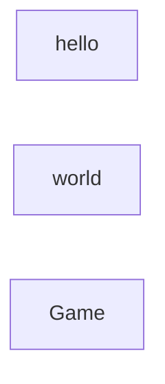
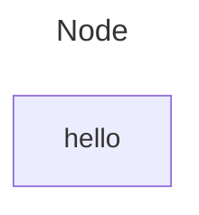
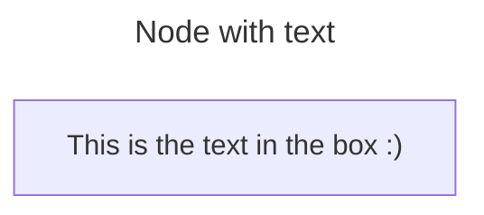
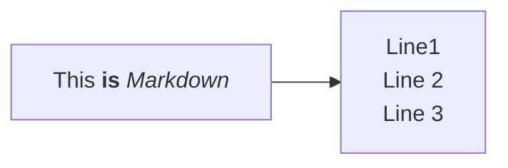

---
titile Node 
--- 

```mermaid 
    flowchart LR 
        a[hello]
        b[world]
        c[Game]
        
```

```mermaid

---
title: Node
---

flowchart LR
    id[hello ]
```

```mermaid
---
title: Node with text
---
flowchart LR
    id1["This is the text in the box :)"]

```

```mermaid
%%{init: {"flowchart": {"htmlLabels": false}} }%%
flowchart LR
    markdown["`This **is** _Markdown_`"]
    newLines["`Line1
    Line 2
    Line 3`"]
    markdown --> newLines

```